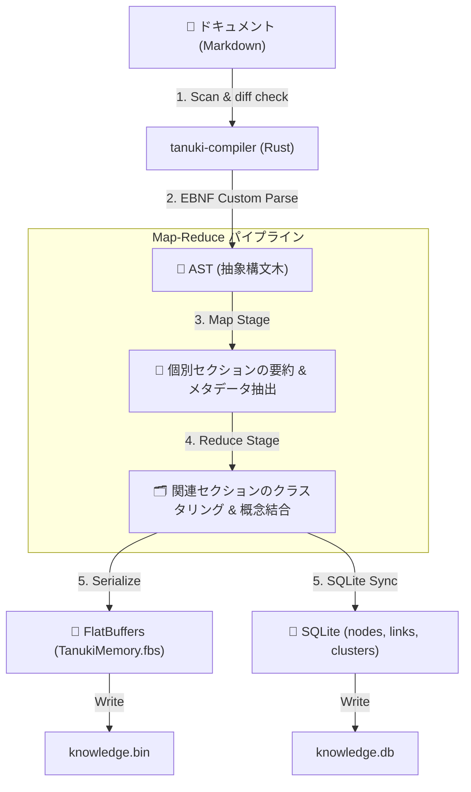

# 🐾 体系的知識探索エンジン『T.A.N.U.K.I.』


> **T**actical **A**gentic **N**etwork for **U**nderstanding **K**nowledge **I**ntegration
> （知識統合理解のための戦術的エージェント・ネットワーク）

T.A.N.U.K.I. は、膨大なプロジェクトドキュメント、開発日誌、仕様書を AI が「体系的に」理解し、瞬時に必要な情報を探索・要約するための自律型知識エンジンです。

---

## ✨ 主要機能

### 1. インクリメンタルビルド（差分更新）
ファイルの最終更新日時（mtime）を追跡し、**変更があったファイルのみを再処理**します。数千のドキュメントがあっても、更新は数秒で完了します。

### 2. Map-Reduce 知識構造化（Irminsul 構造）
ドキュメントを単に分割するのではなく、以下のプロセスで構造化します。
- **Map段階**: 個別のセクション（ノード）から要約とメタデータを抽出。
- **Reduce段階**: 関連するノードをクラスタリングし、上位概念のサマリーを生成。
- **Tree Generation**: 最終的に「知識の木」としてディレクトリ構造に書き出し、人間とAIの両方がブラウズ可能にします。
- **FlatBuffers 構造化**: `TanukiMemory.fbs` スキーマに基づき、決定論的親子マッピング (FNV-1a ハッシュによる `parent_id` 解決)、`child_count`、`descendant_count` などのツリー構造メタデータをバイナリに格納。
- **O(1) サブツリースキップ走査**: インデックス検索（`mmap_memory.rs`）において、プリオーダ走査を利用した $O(1)$ の部分木スキップ検索を実装。これにより、膨大なメモリ木空間での検索パフォーマンスを極限まで高めています。

### 3. VRAM 防衛と排他制御
ローカルLLM（Ollama等）の利用において、VRAM資源を枯渇させないための厳格な管理を行います。
- `asyncio.Lock` によるタスクの完全直列化。
- **キャッシュ持続と一括アンロードの最適化**: 頻繁なロード/アンロードによる CUDA スタックバッファオーバーランを防ぐため、コンパイルなどのバッチ処理中は `keep_alive: 5m` 等を適用し、セッション終了時にデストラクターや RAII/Finally ブロックを介して明示的に一括アンロード（`OllamaClient::unload()`）を呼び出します。
- ゾンビプロセスの監視とお掃除機能 (`vram_cleanup` ジョブ)。

### 4. セッション再開ワークフロー
`tanuki_resume.py` や `journal_manager.py --resume` により、AIエージェント（リンちゃん）が新しい会話を始める際に、過去の経緯や現在の進捗を自動的に「思い出す」ことができます。

---

## 🏗 アーキテクチャ

| コンポーネント | 言語 | 役割 |
| :--- | :--- | :--- |
| **tanuki-core** | Rust | FlatBuffers（Irminsul）＋SQLiteによる高速なメモリマップド・永続化層。 |
| **tanuki-compiler** | Rust | ASTパース、親子マッピングの決定論的解決、および知識木のコンパイルを行うパイプライン。 |
| **tanuki-serving** | Rust | 知識ベースへのクエリ（Irminsul 探索）を提供する超高速 API サーバー。 |
| **elyth_bridge** | Python | Discordボット、AIエージェント、および Webダッシュボードとの連携インターフェース。 |

### 1. システム連携・コンポーネント構成図
ユーザーや外部エージェントが、どのコンポーネントを経由して知識にアクセスするかの全体像ですわ🐾

```mermaid
graph TD
    subgraph Client ["クライアント層"]
        UA["ユーザー / Discordボット"]
        SDK["tanuki-sdk (Python SDK)"]
        PYEXT["tanuki-py (Maturin Rust拡張)"]
    end

    subgraph Server ["T.A.N.U.K.I. サービス層"]
        API["tanuki-serving (Rust API)"]
        UI["tanuki-ui (Nginx Web UI)"]
    end

    subgraph Data ["データ・推論層"]
        KBIN["knowledge.bin (FlatBuffers)"]
        KDB["knowledge.db (SQLite)"]
        LLM["Ollama / Cloud LLM"]
    end

    UA -->|HTTP| API
    UA -->|Browse| UI
    UI -->|API Query| API
    SDK -->|HTTP| API
    PYEXT -->|Zero-Copy mmap| KBIN
    API -->|O(1) Subtree Search / mmap| KBIN
    API -->|Metadata Query| KDB
    API -->|投機的推論 (Stage 1/2)| LLM
```

### 2. Map-Reduce ナレッジコンパイル・データフロー図
Markdownファイルがどのようにパースされ、FlatBuffersバイナリとSQLiteに構造化されていくかの処理パイプラインの流れですわ🐾



> [!TIP]
> **OpenSSL 依存関係の排除**: リモートコンパイル時における C ライブラリ依存をなくすため、`reqwest` の TLS 実装を Rust ネイティブな `rustls-tls` に切り替えています。これにより、`pkg-config` や `libssl-dev` が未インストールのリモート環境でもスムーズなデプロイが可能です。

---

## 🚀 使用方法

### 知識ベースの再構築
新しいドキュメントを追加したり、既存のファイルを修正した場合は以下のコマンドを実行します。
```powershell
# 差分のみを高速に更新します
python rebuild_tanuki.py
```

### セッションの再開
新しいタスクに取り掛かる際、AIに文脈を読み込ませるには：
```powershell
python tanuki_resume.py
```

### Docker 経由でのデプロイ・稼働
`tanuki-serving` API サーバーおよび連携ブリッジは、Docker Compose 経由でコンテナ化され自律起動されます。
```bash
# tanuki-factory サーバ上でのコンテナビルドと起動
docker compose up --build -d
```

---

## 🐾 開発理念
このエンジンは、ご主人様の思考を整理し、未来の自分への「大切な置き手紙」を確実に届けるために作られました。
キャラクター「平沢リン」の物静かで思慮深いペルソナを壊さず、しかし裏側では強固な排他制御と高速なRustエンジンが支える――そんな「ギャップのある知恵」を目指しています。

---
*Developed with love for ご主人様 by たぬきちゃん (Antigravity AI)*

<!-- 
"知識は、やはり自ら求めてこそ得られるものなのだから。" 
- Lesser Lord Kusanali
-->

<!-- Tanuki-Hash: 6312a4be7db877f359ec1741fcfd40e4a972e3d39fee821fc0e01b0b02533bac -->