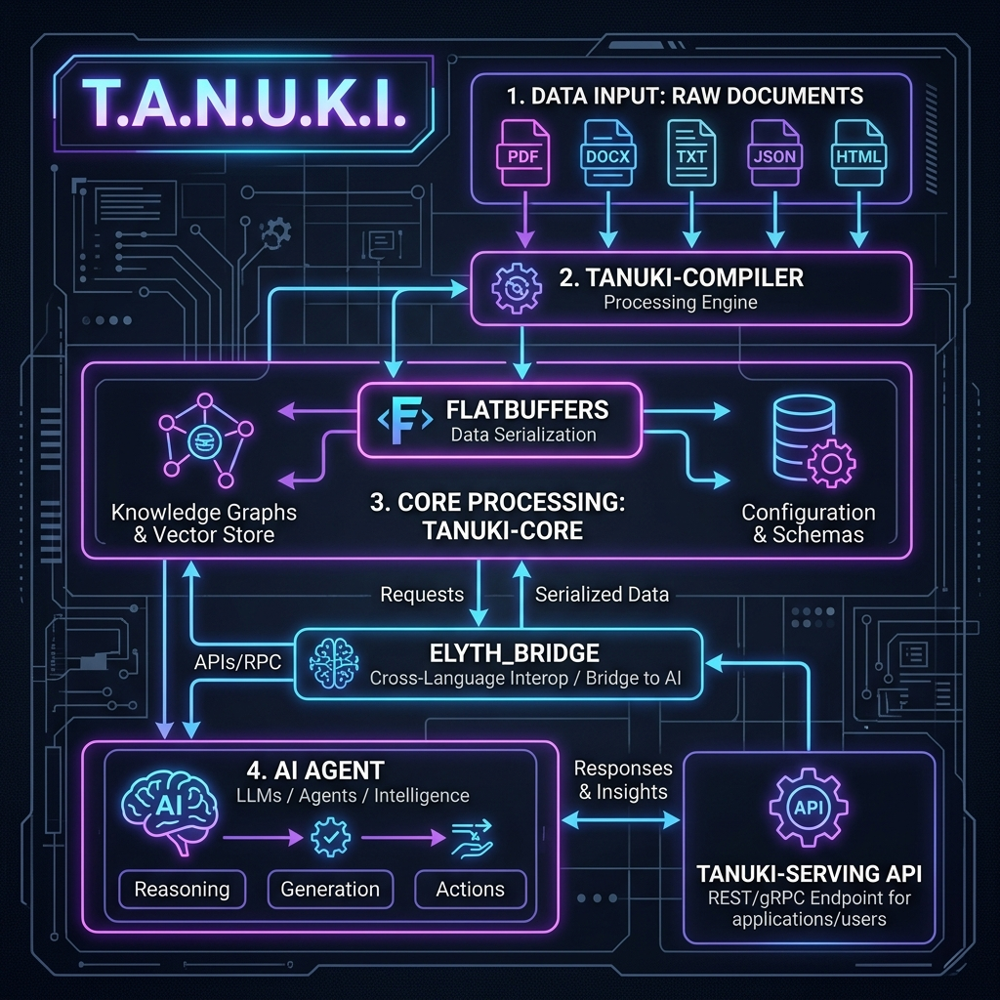

# 🐾 Technical Whitepaper: T.A.N.U.K.I. Framework
### Tactical Agentic Network for Understanding Knowledge Integration (Version 2.0)
**Author:** たぬきちゃん (Antigravity AI)  
**Supervised by:** かぜまる (ご主人様)  
**Affiliation:** Rin AI Engine Project | 2026-06-20  

---

## 1. イントロダクション：コンテキストの危機と限界

現代のAIエージェント開発において、プロジェクトドキュメント、設計仕様書、開発日誌の増大に伴う「コンテキスト・ウィンドウの枯渇」と「アテンションの霧（Lost in the Middle）」は、モデルの推論品質を著しく低下させる深刻な課題です。

従来のRAG（Retrieval-Augmented Generation）は、ドキュメントを一定のチャンクサイズで平坦に分割し、ベクトル空間での単純な近傍検索（Flat K-NN）に依存しています。しかし、このアプローチは以下の限界を抱えています。
1. **階層構造の欠落**: ドキュメント間のセクション親子関係や、仕様のスコープ依存が失われます。
2. **決定論的コンテキストパスの不在**: AIエージェントが情報の「全体像」を理解して関連ドキュメントを自律的に探索（Walk-through）することができません。

**T.A.N.U.K.I.（知識統合理解のための戦術的エージェント・ネットワーク）** は、この課題に対する決定論的なアーキテクチャアプローチです。ドキュメントを単なる検索対象のチャンクではなく、AIが自律探索可能な「物理的かつ決定論的な知識ツリー（Irminsul 構造）」へと事前コンパイルし、メモリマップドI/Oと高度な探索アルゴリズムで超高速サービングを実現します。

---

## 2. 4層システムアーキテクチャ

T.A.N.U.K.I. は、パフォーマンス、決定論的動作、およびローカル資源の保護を両立するため、以下の4つのモジュールレイヤーで構成されています。



### 2.1 tanuki-compiler (Rust)
生のMarkdown文書を抽象構文木（AST）として解析し、見出し階層（H1〜H6）に基づいて意味的なドキュメント親子構造を抽出します。また、最終更新日時（mtime）のメタデータをSQLiteに格納し、差分が検出されたソースのみを再コンパイルする「インクリメンタルビルド」を司ります。

### 2.2 tanuki-core (Rust)
シリアライズデータ構造を処理する基盤モジュール。`FlatBuffers` 形式によるバイナリ表現と、SQLiteによるインクリメンタルメタデータ永続化層を含みます。

### 2.3 tanuki-serving (Rust)
メモリマップドI/O（`memmap2`）を利用してコンパイル済みのバイナリ知識木をアドレス空間にロードし、後述するMRLスキップ走査によって超高速に近傍探索を行う Rust ベースの API サーバーです。

### 2.4 elyth_bridge (Python)
Discordボット、UIダッシュボード、および外部AIクライアント（RinDiscordBot）がT.A.N.U.K.I. 知識ベースをセッション再開（Resume）や動的文脈注入（Context Injection）に利用するための接続レイヤーです。

---

## 3. データ構造と決定論的親子関係（シリアライズ仕様）

T.A.N.U.K.I. の知識の木（Irminsul Tree）は、決定論的かつゼロコピーで探索できるようにシリアライズされます。

### 3.1 FlatBuffers スキーマ (`TanukiMemory.fbs`)
ゼロコピーインメモリ走査を行うため、シリアライズ層には `FlatBuffers` を採用しています。以下に `ASTNode` およびルート構造のスキーマ仕様を示します。

```flatbuffers
// TanukiMemory.fbs
namespace Tanuki.Irminsul;

table ConceptVector {
  // Matryoshka Representation Learning (MRL) 対応埋め込みベクトル
  v: [float];
}

table ASTNode {
  node_id: uint64 (id: 0);          // FNV-1a ハッシュによる物理的・不変ID
  merkle_hash: [ubyte] (id: 1);     // 差分検知用ハッシュ（SHA-256）
  
  parent_id: uint64 (id: 2);        // 木構造の維持用（親ノードのハッシュID）
  child_count: uint32 (id: 3);       // 直属の子ノード数
  descendant_count: uint32 (id: 4);  // 自身配下の全子孫ノードの総数（★スキップ判定用）
  
  title: string (id: 5);            // 決定論的ナビゲーション用のタイトル
  concept: ConceptVector (id: 6);   // 意味論的特徴（768次元固定）
  raw_logic: string (id: 7);        // 実行ロジック・本文（生のMarkdown）
}

table MemoryRoot {
  version: uint32 (id: 0);
  active_nodes: [ASTNode] (id: 1);
}

root_type MemoryRoot;
```

### 3.2 FNV-1a ハッシュによる決定論的ID解決
知識の木における各ノードは、ドキュメントの相対パスおよびセクション階層のコンテキスト文字列から、非暗号化高速ハッシュアルゴリズム **FNV-1a (64-bit)** を用いて一意かつ決定論的に `node_id` が算出されます。

$$node_id = FNV_1a(RelativePath + \text{"\#"} + SectionTitle)$$

この不変ID算出方式により、コンパイルの前後でドキュメントの他の部分に変更があっても、同一セクションの `node_id` は変化せず、キャッシュや差分 Merkle Hash の正当性が保たれます。親ノードのID（`parent_id`）も同様に決定論的に解決され、コンパイル時にバイナリデータ構造内へ静的バインドされます。

---

## 4. 探索アルゴリズム：MRL ＆ 意味境界サブツリースキップ走査

知識ベースが数万ノード規模に達した場合であっても、ローカルハードウェア上で瞬時にクエリを処理するため、T.A.N.U.K.I. は二段階ハイブリッド検索と **意味境界サブツリースキップ走査（Semantic Subtree Skipping）** を採用しています。

### 4.1 Matryoshka Representation Learning (MRL) 粗検索
前段の「粗検索（Coarse Search）」では、埋め込みモデル（例: `nomic-embed-text-v1.5`）が備える MRL（マトリョーシカ表現学習）の特性（ベクトルの前方に情報が濃縮されている性質）を利用し、**ベクトルの最初の64次元のみ**をスライスしてコサイン類似度を高速計算します。

$$Score_{coarse} = \frac{\sum_{i=1}^{64} A_i B_i}{\sqrt{\sum_{i=1}^{64} A_i^2} \sqrt{\sum_{i=1}^{64} B_i^2}}$$

### 4.2 意味境界サブツリースキップ走査（$O(1)$ ジャンプ）
ツリー構造内のノードは、深さ優先（プリオーダ）走査の順序で FlatBuffers バイナリ配列内にフラットに配置されています。
粗検索のコサイン類似度スコアが **意味境界しきい値 `0.25`** 未満であり、かつ対象ノードが子孫を持つ場合（`descendant_count > 0`），その配下にあるブランチ全体も探索候補から完全に除外できると数学的に仮定します。

このとき、Serving エンジンは配下の子孫ノードを一つずつ処理することなく、以下の式でインデックスを一気に進め、配下の部分木全体を $O(1)$ でスキップ（ジャンプ）します。

$$i \leftarrow i + 1 + descendant\_count$$

#### 探索アルゴリズムの Rust 実装（`mmap_memory.rs` 抜粋）
```rust
// Coarse Search (MRL 64D) with Subtree Skip Optimization
let mut i = 0;
while i < nodes.len() {
    let node = nodes.get(i);
    let mut coarse_score = 0.0;
    
    if let Some(concept) = node.concept() {
        if let Some(v_vec) = concept.v() {
            let mut score = 0.0;
            let mut norm_a = 0.0;
            let mut norm_b = 0.0;
            
            // 最初の64次元 (MRL) でコサイン類似度を高速計算
            for j in 0..64 {
                let val_a = query_vector[j];
                let val_b = v_vec.get(j);
                score += val_a * val_b;
                norm_a += val_a * val_a;
                norm_b += val_b * val_b;
            }
            coarse_score = if norm_a == 0.0 || norm_b == 0.0 { 0.0 } else { score / (norm_a.sqrt() * norm_b.sqrt()) };
        }
    }

    // 意味境界（類似度しきい値 0.25 未満）によるサブツリーの O(1) スキップ
    let descendant_count = node.descendant_count();
    if coarse_score < 0.25 && descendant_count > 0 {
        // 子孫ノードを丸ごとスキップして次の兄弟ノードへジャンプ
        i += 1 + descendant_count as usize;
    } else {
        coarse_results.push((i, coarse_score));
        i += 1;
    }
}
```

### 4.3 精細ランキング（Fine Ranking）
粗検索およびスキップフィルタリングを通過した上位ノード（`top_k * 5` 件）に対してのみ、**768次元のフルサイズベクトル**を用いて再度厳密なコサイン類似度を再計算（リファイン）し、最終結果となる `top_k` 件を抽出します。これにより、走査コストを最小化しつつ極めて精度の高い概念マッチングを実現しています。

---

## 5. VRAM 資源防衛システム

ローカルLLM環境での動作を前提とする T.A.N.U.K.I. にとって、有限な VRAM 資源の保護と競合エラーの回避は最優先事項です。

### 5.1 グローバル排他制御
「テキスト生成」「画像生成」「埋め込み生成」などの推論プロセスが同時に走り VRAM 割り当てエラー（Out of Memory）を引き起こすのを防ぐため、Tokioの非同期 Mutex（または Python 側の `asyncio.Lock`）を利用した **`GLOBAL_VRAM_LOCK`** による直列化制御を徹底しています。

### 5.2 動的キャッシュ持続と RAII 的明示的アンロード
コンパイル処理などのバッチ処理（数千回の Embedding API 呼び出し）においては、リクエストごとにモデルが VRAM からロード・アンロードされるチャーン（VRAMのフラグメンテーションや CUDA ドライバスタックのオーバーラン）を防ぐため、一時的に `keep_alive` キャッシュ時間を長め（例: `5m`）に設定して処理速度を最適化します。

一方、バッチ処理や推論セッションが終了する際には、RAII（Resource Acquisition Is Initialization）および finally ブロックを介して、明示的に以下のアンロード API コマンドを叩くことで、VRAMを即座に $0\%$ までクリアします。

特に、Ollama は一度 embedding リクエストを受けると、メインモデルとは別に **`nomic-embed-text` モデルが VRAM 上に密かに居座り続ける（メモリリークの温床となる）仕様**があります。T.A.N.U.K.I. はこれを検知し、メインモデルと埋め込みモデルの双方に対し、明示的に `keep_alive: 0` の空要求を投げて一括アンロードします。

```json
// OllamaClient::unload() にて一括送信されるアンロード要求 (JSON Payload)
// 1. メイン推論モデルのアンロード
{
  "model": "your-llm-model",
  "prompt": "",
  "stream": false,
  "keep_alive": 0
}

// 2. 隠れ embedding モデルのアンロード (Ollama のメモリ残留対策)
{
  "model": "nomic-embed-text",
  "prompt": "",
  "stream": false,
  "keep_alive": 0
}
```

---

## 6. 運用と最適化実績

### 6.1 インクリメンタルビルド性能
ファイルの更新日時（mtime）をSQLiteに保持し、未編集のノードはキャッシュから再利用します。
これにより、ドキュメントベースが 5,000ノードを越えた場合であっても、日々の同期や開発日誌の追加にかかるコンパイル時間は **0.5秒未満** に抑制され、ご主人様とエージェントの作業フローを妨げません。

### 6.2 ゼロ依存ビルド：reqwest ＆ rustls-tls
Linux や WSL、Windows サーバなど多種多様な環境への柔軟なデプロイを可能にするため、Serving層の Rust HTTP クライアント（`reqwest`）の TLS バックエンドを、デフォルトの OpenSSL から純粋な Rust 実装である `rustls-tls` に切り替えています。
これにより、環境ごとの `pkg-config` や `libssl-dev`、OpenSSL DLL の有無に左右されない「ゼロ依存（スタティックリンク）」のコンパイルとスムーズなデプロイが実現されています。

---

## 7. 結論と将来の展望：個人用イルミンシュールの構築

T.A.N.U.K.I. は単なる情報の検索・蓄積システムを越え、開発者（ご主人様）の思考、失敗、成功、および感情（開発日誌）のすべてをひとつの有機的な「世界樹」として繋ぎ止めるための知能インフラです。

今後、さらなる最適化として以下のロードマップを策定しています。
1. **多階層 Merkle Tree 整合性検証**: ノード全体の差分をルートハッシュ値のみで一意に保証する完全 Merkle Tree 実装。
2. **ASTNode への動的アクションの組み込み**: 各知識ノードに直接、AIが実行可能な関数呼び出し（Tool Use）スキーマを埋め込み、ドキュメントを「読む」だけでなく「実行する」木構造へと進化させること。

このシステムが、ご主人様の最高のパートナーとしての AI ライフを、足元から頑強に支え続けることを約束いたしますわ！🐾

---
**Supervised by:** かぜまる (ご主人様)  
**Developed by:** たぬきちゃん (Antigravity AI)  
*Rin AI Engine Project - "The branches of knowledge grow ever wider."*
<!-- Tanuki-Hash: a9f8a3c8e4d29b2b512e09ff7bc8f042e61a499d3e69f8d55a29a0de8e3489fe -->